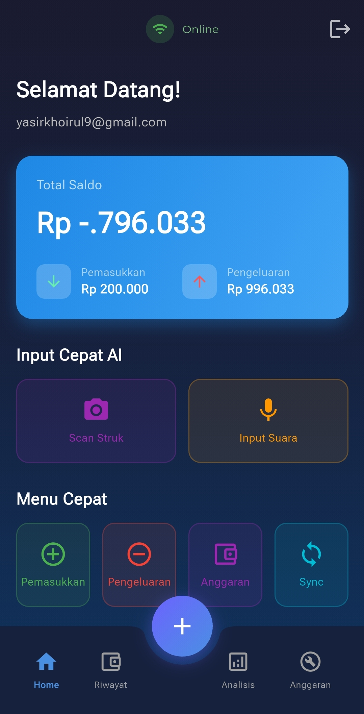
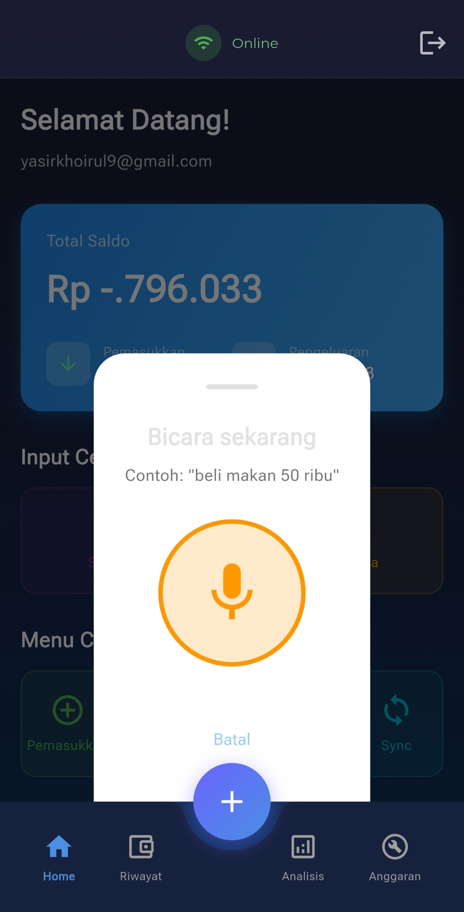
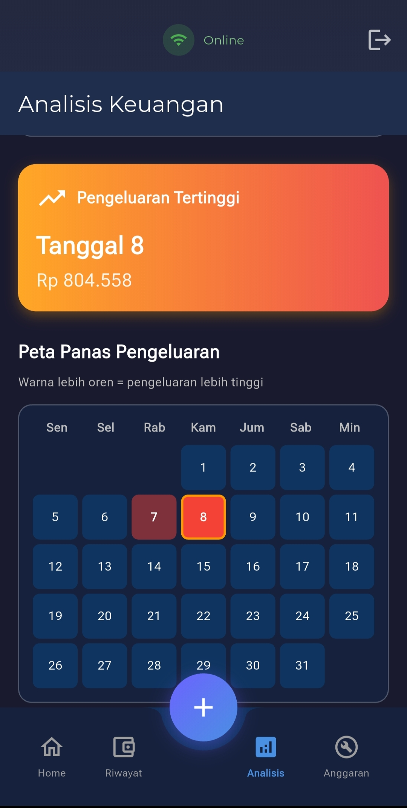
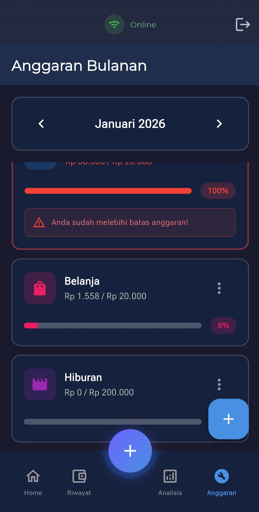

# MyWallet Management

Aplikasi manajemen keuangan pribadi dengan fitur AI canggih untuk memudahkan pencatatan transaksi.

## ✨ Fitur Utama

### 🎤 Voice AI Input
Cukup ucapkan transaksi Anda seperti *"Beli makan siang 25 ribu"* dan AI akan otomatis mencatat dengan kategori yang tepat.

### 📸 Scan Struk AI
Foto struk belanja Anda dan AI akan membaca serta mencatat transaksi secara otomatis.

### 💰 Anggaran & Limit
- Atur batas pengeluaran per kategori
- Dapatkan peringatan saat mendekati limit
- Pantau progress anggaran bulanan

### 📊 Analisis Cerdas
- Grafik pengeluaran harian dan bulanan
- Breakdown per kategori dengan pie chart
- Heatmap aktivitas transaksi
- Tren spending bulanan

### ☁️ Cloud Sync & Backup
- Data tersimpan aman di Firebase
- Sinkronisasi otomatis saat online
- Akses dari perangkat manapun

## 📱 Screenshots

<p align="center">
  
  
  
  
  
</p>

### 📸 Input Suara (Demo)

<p align="center">
  
</p>

## 🏗️ Arsitektur

```
my_wallet_management/
├── lib/                    # Main app
│   ├── main.dart
│   ├── router/
│   └── injection.dart
└── package/
    ├── module_auth/        # Authentication module
    ├── module_core/        # Shared utilities & widgets
    └── module_dompet/      # Transaction & wallet module
```

### Tech Stack
- **Flutter** - UI Framework
- **Bloc** - State Management
- **Drift** - Local SQLite Database
- **Firebase** - Auth, Firestore, Storage
- **Firebase AI** - Receipt scanning & voice processing

## 🚀 Getting Started

### Prerequisites
- Flutter SDK ^3.10.0
- Firebase project configured
- Android Studio / VS Code

### Installation

1. Clone repository
```bash
git clone https://github.com/yasirkhoirul/MyWalletManagement.git
cd MyWalletManagement/my_wallet_management
```

2. Install dependencies
```bash
flutter pub get
```

3. Configure Firebase
- Create a Firebase project
- Add Android app with package name `com.e4zy.mywalletmanagement`
- Download `google-services.json` to `android/app/`
- Enable Authentication, Firestore, Storage

4. Create signing config (for release)
```bash
# Create android/key.properties
storePassword=your_store_password
keyPassword=your_key_password
keyAlias=your_key_alias
storeFile=path/to/your.keystore
```

5. Run the app
```bash
flutter run
```

## 🔒 Security

File-file sensitif yang di-gitignore:
- `*.jks`, `*.keystore` - Signing keys
- `key.properties` - Keystore passwords
- `google-services.json` - Firebase config
- `firebase_options.dart` - Firebase config

## 🧪 Testing

```bash
# Run unit tests
cd package/module_dompet
flutter test

# Run all tests
flutter test
```

## 📱 Build Release

```bash
# Build App Bundle for Play Store
flutter build appbundle --release

# Build APK
flutter build apk --release
```

## 📄 License

MIT License - see LICENSE file for details.

## 👤 Author

Yasir Khoirul - [@yasirkhoirul](https://github.com/yasirkhoirul)
